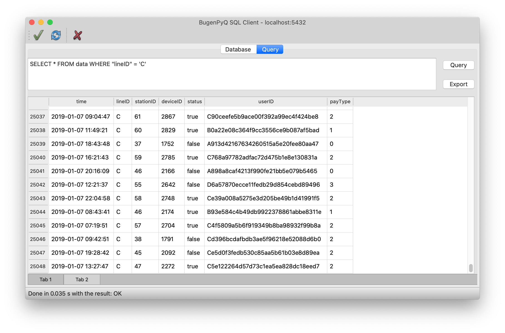

# CS902 (Python) Final Project

### Overview


**BugenPyQ SQL Client** is a simple SQL client with GUI based on PyQt. It allows users to connect several kinds of SQL database and supports visual editing and SQL statement queries.


### Introductions

#### Preview all tables in the database and perform visual editing


After open a database in **BugenPyQ SQL Client**, you can select the active table through the tables list and edit data in it directly at the preview window. Use **Submit** to submit the modification.

#### Supports opening local SQLite file, remote PostgreSQL and MySQL database as well


**BugenPyQ SQL Client** can not only open an SQLite file locally, but also support connecting to remote PostgreSQL or MySQL database (driver compilation is probably needed under different OS).

#### Multi-tabbed and multi-threaded SQL queries, executing several SQL operations simultaneously



Users can perform SQL queries at the second tab of **BugenPyQ SQL Client **. **BugenPyQ SQL Client** is multi-tabbed. To add a query tab, please press **⌘T / Ctrl+T** or simply via **File** menu. Also, the query system supports multi-threading technology that no other operations will be interfered even when you are dealing with a busy query.

#### Export the results to a CSV file


While querying in **BugenPyQ SQL Client**, you can not only save the results with statements like  `SELECT INTO` , but also export the query results to a CSV (comma-separated values) file for further data analysis.


### Build and Run


1. Make sure the Python version is higher than 3.7. 
2. Install latest `PyQt5` module: `python3 -m pip install PyQt5 --user` . 
3. Run `python3 ./main.py`.


### Designing

```bash
.
├── connectionDialog.py
├── database.py
├── databaseView.py
├── example.py
├── exporter.py
├── main.py
├── queriesContainer.py
├── queryView.py
└── sqlites # examples
    ├── product.sqlite
    ├── students.sqlite
    └── test.sqlite
```

**Highlights:**

1. All of the widgets are implemented in a separate module (.py), which is loosely coupled with the main window, resulting in clearer code logic, strong reusability and dynamic compilation with performance improvement.
2. Maintaining connections with a separate database manager class (database.py), separating the UI code from the logic code.
3. Make use of multi-threading and PyQt signal-slot technology to avoid time-consuming operation in the main UI thread and ensure the program GUI fluency and stability.
4. Easy operation logic and attention to details, such as:
   - Adopt Layout comprehensively, scaling the window arbitrarily is allowed.
	- Allows users to connect and disconnect multiple times and reuse program functions.
	- Adjust the enabled state of buttons and actions bringing to strong program robustness.
	- When new/open/close/exit, the user will be prompted to save the current changes to avoid misoperations.
	- Indicates current connection information and operation status through the status bar and title bar.
	- Keyboard shortcuts are supported on any platforms, which is in line with the user's usual operation logic.


### Acknowledgement

**Thanks to Professor Lu and the TAs for their guidance!**